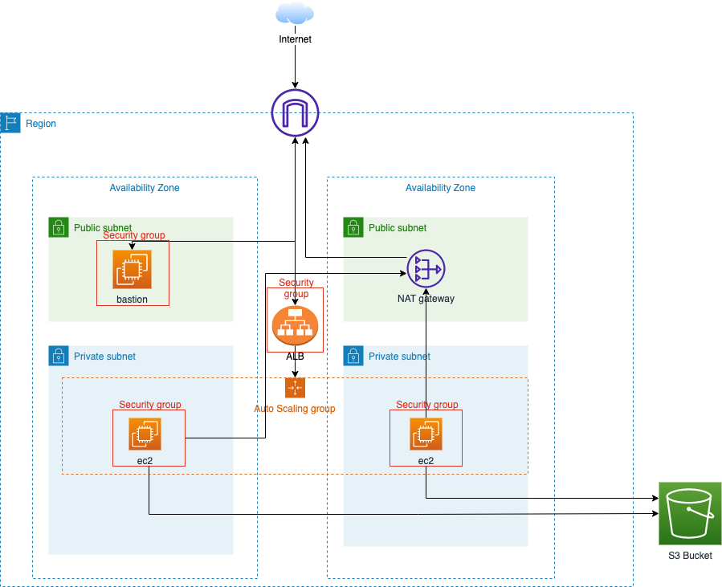
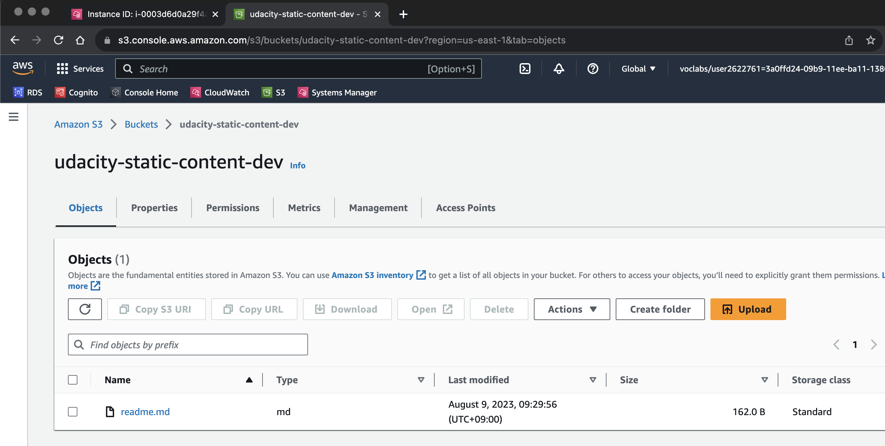
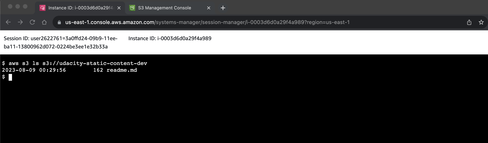

# CD12352 - Infrastructure as Code Project Solution
## Architecture

## Spin up instructions
please run bellow comman inside `starter` folder
```sh
./deploy-network.sh
./deploy-app.sh
```

## Tear down instructions
please run bellow comman inside `starter` folder
```sh
./destroy-network.sh
./destroy-app.sh
```

## Testing
to proof ec2 instances can access to `s3` bucket.  
i go into ec2 and execute `s3 ls` command to get `s3 bucket`'s content.



